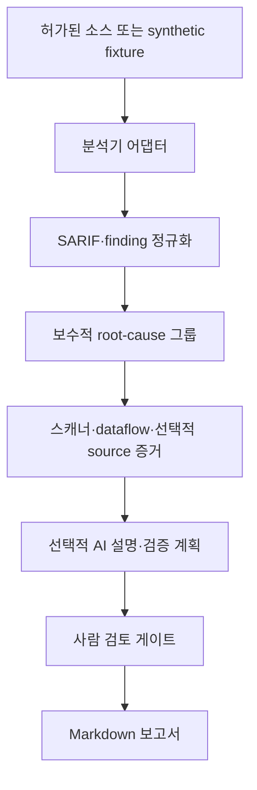
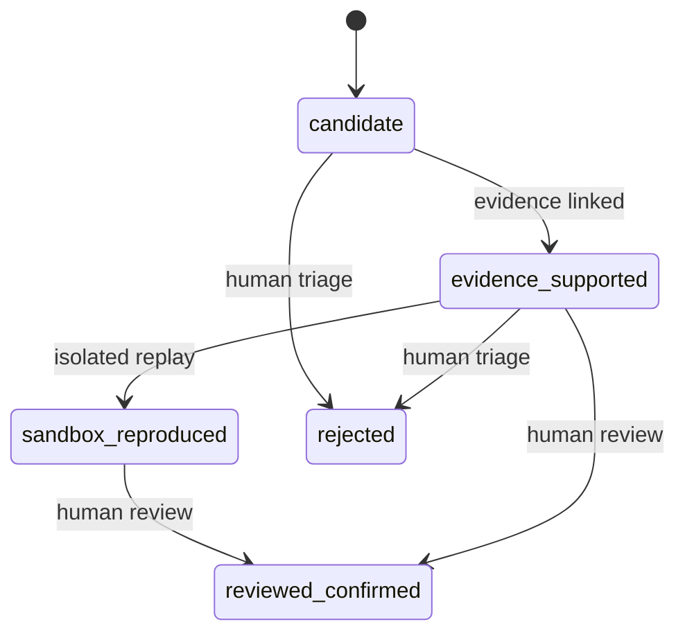

# Architecture

## 1. 설계 목표

`bob15th-after-ad-sast`는 여러 정적 분석기의 결과를 한 형식으로 모으고, 사람이 검토할 수 있는 증거 묶음으로 만드는 로컬 우선 연구 도구입니다. 핵심 목표는 탐지 개수를 늘리는 것 자체가 아니라 다음 세 가지입니다.

1. 같은 근본 원인에서 발생한 중복 finding을 묶습니다.
2. MVP에서는 정적 경고를 SARIF source-to-sink 경로와 선택적 소스 조각에 연결합니다.
3. AI의 역할을 설명·우선순위·검증 계획 제안으로 제한하고 최종 확정은 사람이 수행합니다.

설정, patch diff, runtime 로그와 격리 실행 결과의 표준 가져오기 및 상태 전이는 다음 단계의 연구 범위입니다. 현재 구현과 목표 아키텍처를 구분해 해석해야 합니다.

다음은 목표가 아닙니다.

- AI 단독 취약점 확정
- 생성 payload의 외부 대상 자동 실행
- 원본 공방전 문제 코드·flag·payload 보관
- CodeQL 또는 다른 제3자 분석기의 재배포
- 분석 대상 저장소의 빌드 스크립트 자동 신뢰

## 2. 전체 구조



분석기 어댑터는 Semgrep의 빠른 패턴·taint 분석과, 사용자가 별도로 설치한 CodeQL의 SARIF 출력을 받을 수 있습니다. 현재 MVP CLI는 요청한 분석기 중 하나라도 실패하면 해당 실행을 실패로 종료합니다. 분석기별 부분 성공 결과를 보존하는 기능은 후속 과제입니다.

회귀 테스트는 사람이 검토해 별도로 만드는 후속 산출물입니다. 현재 CLI는 payload나 회귀 테스트를 생성·실행하지 않으며, 설정·patch·runtime 증거를 가져오는 입력 경로도 아직 없습니다.

## 3. CLI 경계

| 명령 | 입력 | 주요 동작 | 외부 대상 접속 |
| --- | --- | --- | --- |
| `bob15-sast doctor` | 로컬 환경 | Python, 선택 분석기, 설정 상태 점검 | 없음 |
| `bob15-sast demo` | 내장 synthetic fixture | 안전한 예제 분석·정규화 | 없음 |
| `bob15-sast analyze PATH` | 허가된 로컬 경로 | 선택 분석기 실행 및 결과 통합 | 기본값 없음 |
| `bob15-sast ingest FILE` | SARIF 파일 | 결과 파싱·정규화·요약 | 없음 |

`analyze`가 동적 재현을 암묵적으로 수행해서는 안 됩니다. 동적 검증은 별도 승인된 격리 단계에서 실행하고, 생성된 증거만 파이프라인에 다시 입력하는 구조를 유지합니다.

`analyze`의 기본 output root는 분석 대상 밖에 매 실행 새로 만드는 비공개 운영체제 임시 디렉터리 `bob15-sast-artifacts-*`입니다. 사용자가 `--output`을 지정해도 대상 자체 또는 대상 하위 경로이면 실행을 거부합니다. 로컬 scanner 실행은 프로세스 그룹 전체를 종료할 수 있는 POSIX에서만 허용하며, Windows에서는 외부에서 만든 SARIF를 `ingest`해야 합니다. 외부 검증 증거를 다시 입력하는 인터페이스는 목표 구조일 뿐 현재 CLI에는 구현되지 않았습니다.

## 4. 컴포넌트

### 4.1 분석기 어댑터

현재 어댑터는 각 도구의 종료 코드, 제한된 stdout·stderr와 원본 결과 위치를 실행 중 관리합니다. 도구 버전과 실행 환경 hash를 결과 manifest에 영구 기록하는 기능은 재현성 강화를 위한 후속 과제입니다. Semgrep은 짧은 공방전 시간 안에 패턴과 taint 후보를 빠르게 찾는 역할에 적합합니다. CodeQL은 컴파일·데이터베이스 생성 비용이 있지만 언어별 데이터 흐름을 더 깊게 추적할 때 보조적으로 사용합니다.

CodeQL은 이 프로젝트의 필수 런타임이나 번들 의존성이 아닙니다. 적용되는 라이선스 및 CLI 이용 조건은 사용자가 현재 약관을 확인해야 합니다. 어댑터는 CodeQL CLI 2.16.4 이상의 no-build 경로만 사용하고 저장소의 빌드 명령을 실행하지 않으며, 설치 버전을 자동 검증하지는 않습니다. `java-kotlin`의 no-build 추출은 Java만 분석하고 Kotlin을 지원하지 않으므로, Kotlin 또는 실제 빌드가 필요한 대상은 별도 격리 환경에서 CodeQL 분석을 끝낸 뒤 SARIF만 `ingest`해야 합니다.

Semgrep 호출은 ignore 관련 override를 추가하지 않으므로 실제 파일 선택은 설치된 Semgrep 버전의 기본 동작과 그 버전이 인식하는 대상 ignore 파일에 좌우됩니다. Trivy는 대상 밖에 만든 격리 작업 디렉터리를 `cwd`로 사용하고, 그 안의 신뢰된 빈 `trivy.yaml`과 빈 ignorefile을 명시하므로 대상의 `trivy.yaml`·`.trivyignore`를 읽지 않습니다. `.git`은 별도로 skip합니다. CLI의 Trivy offline scan은 대상 밖에 미리 채운 기존 접근 가능 `--trivy-cache-dir`를 필수로 요구합니다. offline mode는 네트워크·업데이트·telemetry를 차단하므로 필요한 DB와 도구 자산을 cache에 미리 준비해야 합니다. 현재 manifest는 분석기 버전, cache 준비 상태와 최종 스캔 파일 목록을 기록하지 않습니다.

모든 scanner 실행 파일은 정제된 PATH로 resolve한 뒤 허용 목록과 대상 경계를 확인합니다. resolve된 실행 파일이 분석 대상 내부이면 거부하므로 scanner용 가상환경과 도구 설치 경로도 대상 밖에 두어야 합니다.

### 4.2 결과 정규화

SARIF를 포함한 원본 결과는 최소한 다음 공통 필드로 변환합니다.

```json
{
  "fingerprint": "sha256:stable-finding-id",
  "service": "synthetic",
  "tool": "semgrep",
  "rule_id": "bob15.python.command-injection",
  "severity": "high",
  "cwes": ["CWE-78"],
  "suppressed": false,
  "baseline_state": "new",
  "locations": [
    {
      "path": "fixtures/synthetic/vulnerable.py",
      "line": 17,
      "column": 5,
      "end_line": 17,
      "end_column": 28
    }
  ],
  "code_flows": [
    {
      "steps": [
        {
          "location": {
            "path": "fixtures/synthetic/vulnerable.py",
            "line": 12,
            "column": 12,
            "end_line": 12,
            "end_column": 24
          },
          "execution_order": 1,
          "kinds": ["source"]
        }
      ]
    }
  ]
}
```

이 예시는 `ingest`와 `normalized-findings.json`이 내보내는 public schema입니다. 원본 scanner message, scanner별 properties, source snippet과 `original_uri`는 의도적으로 제외합니다. 현재 MVP는 실행 ID, 입력 SARIF 파일명과 후보 수를 기록합니다. 원본 파일 hash, 분석기 버전, 규칙 버전과 실행 시각을 완전한 provenance로 보관해 stale finding을 구분하는 기능은 후속 과제입니다. 비밀값과 실제 payload는 evidence에 저장하지 않습니다.

SARIF `kind`가 `pass` 또는 `notApplicable`이면 finding으로 만들지 않습니다. public schema의 `suppressed`는 suppression 중 `status=accepted`가 하나라도 있을 때만 참이고, `baseline_state`는 유효한 `new`·`unchanged`·`updated`·`absent` 값을 보존하며 그 밖에는 `null`입니다. suppressed finding도 grouping에서 제외하거나 자동 기각하지 않습니다. group은 모든 구성 finding이 accepted suppression이면 `suppressed_candidate`, 그렇지 않으면서 모든 구성 finding의 baseline이 absent이면 `baseline_absent`, 그 밖에는 `candidate`로 표시합니다. 이는 완전한 suppression 정책 적용이나 baseline-aware delta 계산이 아닙니다.

분석기가 스캔 전에 ignore한 파일은 애초에 SARIF에 나타나지 않으므로, 위 suppression 보존과 혼동해서는 안 됩니다. 현재 파이프라인은 scanner ignore 정책을 복원하거나 누락 파일을 추정하지 않습니다.

### 4.3 중복 제거와 상관분석

현재 MVP의 중복 키는 `service + CWE + normalized sink path + line`이고, 같은 위치에서 CWE 집합이 겹치는 도구 결과를 묶는 보수적 heuristic을 사용합니다. endpoint, 호출 경로와 patch hunk를 함께 비교하는 고급 상관분석은 후속 과제입니다. 심각도가 높더라도 도달성 증거가 없으면 확정 상태로 승격하지 않습니다.

### 4.4 증거 저장

현재 파이프라인이 실제로 수집하는 증거는 다음과 같습니다.

| 현재 증거 | 내용 | 수집 조건 |
| --- | --- | --- |
| 스캐너 요약 | tool, rule ID, severity, CWE, sink | 항상 |
| SARIF 데이터 흐름 | 첫 번째 code flow의 최대 20개 위치 | SARIF에 flow가 있을 때 |
| 소스 조각 | sink 전후의 마스킹된 줄 | `--include-source`를 명시했을 때 |

구성·의존성 snapshot, patch diff, runtime 로그, 격리 재현, 사람 검토 서명의 표준 import는 로드맵입니다. `EvidenceKind` schema에 해당 종류가 예약되어 있다는 사실은 importer가 구현되었다는 뜻이 아닙니다.

HTTP 401·403은 현재 요청이 차단되었다는 증거일 뿐, 코드에 결함이 없다는 증거가 아닙니다. 반대로 HTTP 200도 민감 데이터 또는 보안 조건 위반이 확인되지 않으면 취약점 성공으로 간주하지 않습니다.

### 4.5 AI 보조 계층

AI에는 전체 저장소와 비밀값을 무제한 제공하지 않습니다. 최소한의 관련 함수, 정적 경로, 규칙 metadata, 패치 hunk와 민감정보를 제거한 실행 증거만 제공합니다. 출력은 자유 서술보다 구조화된 제안을 우선합니다.

```json
{
  "finding_id": "stable-finding-id",
  "title": "Possible command injection at a shell sink",
  "disposition": "needs_review",
  "summary": "The scanner and data-flow evidence identify a candidate sink.",
  "root_cause_hypothesis": "Input validation may be missing before the shell sink.",
  "cwe": "CWE-78",
  "reachability": "unknown",
  "confidence": 0.62,
  "evidence_ids": ["EV-scanner", "EV-dataflow"],
  "missing_evidence": ["External route reachability has not been established."],
  "recommended_actions": ["Add a synthetic negative regression test."],
  "requires_human_confirmation": true
}
```

AI 출력에는 존재하는 증거 ID만 인용할 수 있습니다. 존재하지 않는 파일·함수·줄을 인용하거나 증거와 모순되는 경우 제안을 폐기합니다. AI는 `reviewed_confirmed`를 부여하거나 생성 payload를 실행할 권한이 없습니다.

현재 OpenAI provider는 root-cause group마다 Responses API를 한 번씩 직렬 호출합니다. 기본 `--max-ai-groups`는 20이며, group 수가 상한을 넘으면 어떤 provider 호출도 하기 전에 실패합니다. provider가 꺼져 있으면 이 상한은 적용되지 않습니다. 이 통제는 최대 호출 횟수만 제한하므로 token 수나 실제 비용을 확정하지 않으며, 운영자는 더 낮은 상한과 제공자 계정의 예산 제한을 함께 사용해야 합니다. batch 호출, token 추정과 누적 비용 차단은 아직 구현되지 않았습니다.

pipeline은 기본적으로 finding 5,000개와 root-cause group 500개까지만 허용하고, 초과 여부를 output 디렉터리 생성 전에 검사합니다. `demo`와 `analyze`의 `--max-findings`·`--max-groups`로 한도를 명시적으로 바꿀 수 있지만 리소스와 검토량을 함께 평가해야 합니다.

## 5. 목표 상태 전이

다음은 연구 평가에 사용할 목표 모델이며 현재 CLI가 수행하는 자동 상태 머신이 아닙니다. MVP artifact는 group을 기본 `candidate`로 기록하고 SARIF metadata에 따라 `suppressed_candidate` 또는 `baseline_absent`로 표시할 수 있으며, 사람 검토 상태는 `pending_review`입니다. AI assessment는 어떤 상태도 승격하지 않습니다.



심각도는 영향·가능성에 관한 평가이고 상태는 증거 수준입니다. 두 값을 합치지 않아야 Critical 후보가 자동으로 확정 취약점처럼 보고되는 일을 막을 수 있습니다.

## 6. 신뢰 경계와 위협 모델

분석 대상 저장소는 적대적 입력으로 간주합니다. README와 주석을 통한 prompt injection, 빌드 스크립트의 임의 명령, symlink를 통한 경로 이탈, 압축폭탄·대용량 파일, secret 유출과 resource exhaustion을 고려해야 합니다.

권장 통제는 다음과 같습니다.

- 읽기 전용 checkout과 별도 임시 작업 디렉터리
- 기본 네트워크 차단
- 비루트 컨테이너와 최소 filesystem mount
- CPU·메모리·파일 크기·실행 시간 제한
- 허용 확장자 및 저장소 경계 검증
- secret redaction 이후 AI 호출
- 외부 빌드 훅과 package lifecycle script 기본 비활성화
- 생성 patch의 수동 승인, 빌드·기존 테스트·보안 회귀 테스트 분리

## 7. 공개 데이터 경계

공개 저장소에는 synthetic fixture, 일반화한 rule, 비식별 집계 수치만 포함합니다. BoB 원본 문제 자료와 실제 공격 payload·flag는 로컬 연구 기록과도 분리해야 하며, 공개 artifact 생성 단계에서 denylist와 수동 검토를 모두 적용합니다.
