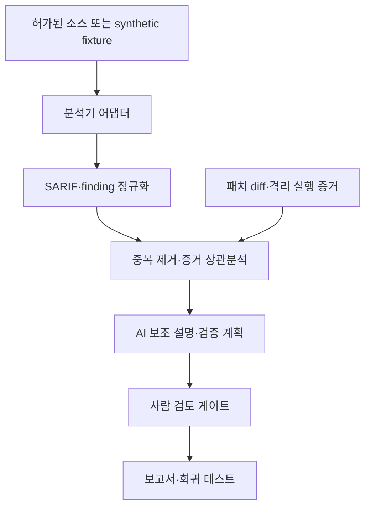
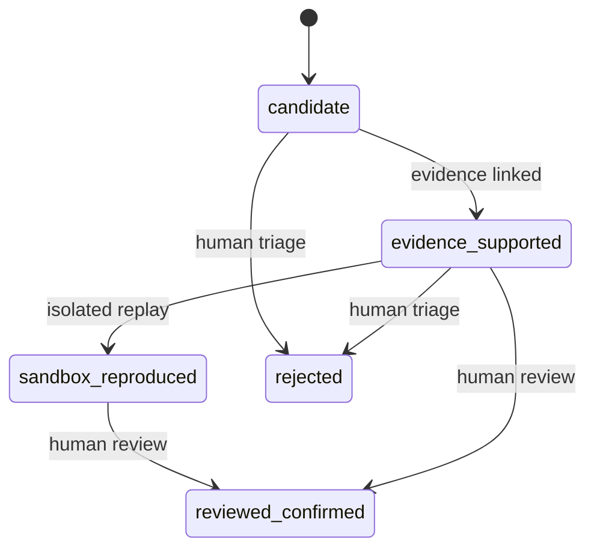

# Architecture

## 1. 설계 목표

`bob15th-after-ad-sast`는 여러 정적 분석기의 결과를 한 형식으로 모으고, 사람이 검토할 수 있는 증거 묶음으로 만드는 로컬 우선 연구 도구입니다. 핵심 목표는 탐지 개수를 늘리는 것 자체가 아니라 다음 세 가지입니다.

1. 같은 근본 원인에서 발생한 중복 finding을 묶습니다.
2. 정적 경고를 endpoint, source-to-sink 경로, 설정, 패치 diff 및 격리 실행 결과와 연결합니다.
3. AI의 역할을 설명·우선순위·검증 계획 제안으로 제한하고 최종 확정은 사람이 수행합니다.

다음은 목표가 아닙니다.

- AI 단독 취약점 확정
- 생성 payload의 외부 대상 자동 실행
- 원본 공방전 문제 코드·flag·payload 보관
- CodeQL 또는 다른 제3자 분석기의 재배포
- 분석 대상 저장소의 빌드 스크립트 자동 신뢰

## 2. 전체 구조



분석기 어댑터는 Semgrep의 빠른 패턴·taint 분석과, 사용자가 별도로 설치한 CodeQL의 SARIF 출력을 받을 수 있습니다. 현재 MVP CLI는 요청한 분석기 중 하나라도 실패하면 해당 실행을 실패로 종료합니다. 분석기별 부분 성공 결과를 보존하는 기능은 후속 과제입니다.

## 3. CLI 경계

| 명령 | 입력 | 주요 동작 | 외부 대상 접속 |
| --- | --- | --- | --- |
| `bob15-sast doctor` | 로컬 환경 | Python, 선택 분석기, 설정 상태 점검 | 없음 |
| `bob15-sast demo` | 내장 synthetic fixture | 안전한 예제 분석·정규화 | 없음 |
| `bob15-sast analyze PATH` | 허가된 로컬 경로 | 사용 가능한 분석기 실행 및 결과 통합 | 기본값 없음 |
| `bob15-sast ingest FILE` | SARIF 파일 | 결과 파싱·정규화·요약 | 없음 |

`analyze`가 동적 재현을 암묵적으로 수행해서는 안 됩니다. 동적 검증은 별도 승인된 격리 단계에서 실행하고, 생성된 증거만 파이프라인에 다시 입력하는 구조를 유지합니다.

## 4. 컴포넌트

### 4.1 분석기 어댑터

현재 어댑터는 각 도구의 종료 코드, 제한된 stdout·stderr와 원본 결과 위치를 실행 중 관리합니다. 도구 버전과 실행 환경 hash를 결과 manifest에 영구 기록하는 기능은 재현성 강화를 위한 후속 과제입니다. Semgrep은 짧은 공방전 시간 안에 패턴과 taint 후보를 빠르게 찾는 역할에 적합합니다. CodeQL은 컴파일·데이터베이스 생성 비용이 있지만 언어별 데이터 흐름을 더 깊게 추적할 때 보조적으로 사용합니다.

CodeQL은 이 프로젝트의 필수 런타임이나 번들 의존성이 아닙니다. 적용되는 라이선스 및 CLI 이용 조건은 사용자가 현재 약관을 확인해야 합니다.

### 4.2 결과 정규화

SARIF를 포함한 원본 결과는 최소한 다음 공통 필드로 변환합니다.

```json
{
  "id": "stable-finding-id",
  "tool": "semgrep",
  "rule_id": "bob15.python.command-injection",
  "path": "fixtures/synthetic/vulnerable.py",
  "start_line": 17,
  "severity": "high",
  "cwe": ["CWE-78"],
  "message": "Untrusted input reaches a shell command",
  "status": "candidate",
  "evidence": [],
  "provenance": {}
}
```

현재 MVP는 실행 ID, 입력 SARIF 파일명과 후보 수를 기록합니다. 원본 파일 hash, 분석기 버전, 규칙 버전과 실행 시각을 완전한 provenance로 보관해 stale finding을 구분하는 기능은 후속 과제입니다. 비밀값과 실제 payload는 evidence에 저장하지 않습니다.

### 4.3 중복 제거와 상관분석

현재 MVP의 중복 키는 `service + CWE + normalized sink path + line`이고, 같은 위치에서 CWE 집합이 겹치는 도구 결과를 묶는 보수적 heuristic을 사용합니다. endpoint, 호출 경로와 patch hunk를 함께 비교하는 고급 상관분석은 후속 과제입니다. 심각도가 높더라도 도달성 증거가 없으면 확정 상태로 승격하지 않습니다.

### 4.4 증거 저장

증거는 강도와 출처를 함께 기록합니다.

| 증거 | 예 | 신뢰도 용도 |
| --- | --- | --- |
| 정적 위치 | 파일, 줄, rule ID | 후보 생성 |
| 데이터 흐름 | source → sanitizer → sink | 근본 원인 보강 |
| 구성·의존성 | 노출 설정, 버전 | 실행 조건 보강 |
| 패치 변화 | guard 추가, sink 교체 | 가설 및 회귀 조건 생성 |
| 격리 재현 | 상태 코드, canary 변화 | 악용 가능성 보강 |
| 사람 검토 | 영향·전제조건 확인 | 최종 확정 |

HTTP 401·403은 현재 요청이 차단되었다는 증거일 뿐, 코드에 결함이 없다는 증거가 아닙니다. 반대로 HTTP 200도 민감 데이터 또는 보안 조건 위반이 확인되지 않으면 취약점 성공으로 간주하지 않습니다.

### 4.5 AI 보조 계층

AI에는 전체 저장소와 비밀값을 무제한 제공하지 않습니다. 최소한의 관련 함수, 정적 경로, 규칙 metadata, 패치 hunk와 민감정보를 제거한 실행 증거만 제공합니다. 출력은 자유 서술보다 구조화된 제안을 우선합니다.

```json
{
  "finding_id": "stable-finding-id",
  "hypothesis": "missing allow-list before shell sink",
  "evidence_refs": ["static-flow-1", "patch-hunk-2"],
  "uncertainties": ["route reachability not established"],
  "recommended_checks": ["add a synthetic negative regression test"],
  "suggested_status": "evidence_supported"
}
```

AI 출력에는 존재하는 증거 ID만 인용할 수 있습니다. 존재하지 않는 파일·함수·줄을 인용하거나 증거와 모순되는 경우 제안을 폐기합니다. AI는 `reviewed_confirmed`를 부여하거나 생성 payload를 실행할 권한이 없습니다.

## 5. 상태 전이



심각도는 영향·가능성에 관한 평가이고 상태는 증거 수준입니다. 두 값을 합치지 않아야 Critical 후보가 자동으로 확정 취약점처럼 보고되는 일을 막을 수 있습니다.

## 6. 신뢰 경계와 위협 모델

분석 대상 저장소는 적대적 입력으로 간주합니다. README와 주석을 통한 prompt injection, 빌드 스크립트의 임의 명령, symlink를 통한 경로 이탈, 압축폭탄·대용량 파일, secret 유출과 resource exhaustion을 고려해야 합니다.

권장 통제는 다음과 같습니다.

- 읽기 전용 checkout과 별도 임시 작업 디렉터리
- 기본 네트워크 차단
- 비루트 컨테이너와 최소 filesystem mount
- CPU·메모리·파일 크기·실행 시간 제한
- 허용 확장자 및 저장소 경계 검증
- secret redaction 이후 AI 호출
- 외부 빌드 훅과 package lifecycle script 기본 비활성화
- 생성 patch의 수동 승인, 빌드·기존 테스트·보안 회귀 테스트 분리

## 7. 공개 데이터 경계

공개 저장소에는 synthetic fixture, 일반화한 rule, 비식별 집계 수치만 포함합니다. BoB 원본 문제 자료와 실제 공격 payload·flag는 로컬 연구 기록과도 분리해야 하며, 공개 artifact 생성 단계에서 denylist와 수동 검토를 모두 적용합니다.
